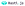

# <a href='http://rasti.js.org'></a>

Rasti is lightweight JavaScript MV framework for building user interfaces.
It gives structure to applications by providing models that emit events on properties changes, and views with declarative event handling to define UI components.
Rasti is inspired in Backbone. You can consider it as an ES6 version with no underscore or jQuery dependencies of Backbone's model and view.
It's ideal for building simple applications without the need of a module bundler, config or boilerplate.
The project is [hosted on GitHub](https://github.com/8tentaculos/rasti), and it's available for use under the [MIT](LICENSE.md) software license.
You can report bugs and discuss features on the [GitHub issues page](https://github.com/8tentaculos/rasti/issues).

## Installation

#### Using npm

```
npm install --save rasti
```

```javascript
import View from 'rasti';

class TodoView extends View {
    
}
```

#### Using `<script>` tag

```html
<script src="https://unpkg.com/rasti/"></script>
```

```javascript
class TodoView extends Rasti.View {
    
}
```

The rasti npm package includes precompiled production and development UMD builds in the dist folder. They can be used directly without a bundler and are thus compatible with many popular JavaScript module loaders and environments. For example, you can drop a UMD build as a `<script>` tag on the page, or tell Bower to install it. The UMD builds make Rasti available as a window.Rasti global variable.

## Example

The rasti npm package includes, in the example folder, a [vanila js](https://github.com/8tentaculos/rasti/tree/master/example/todo) and a [webpack](https://github.com/8tentaculos/rasti/tree/master/example/todo-webpack) versions of a [Todo app](example/todo/) that can be used as starter project.

## API

Complete [API documentation](docs/api.md).

## License

[MIT](LICENSE.md)
